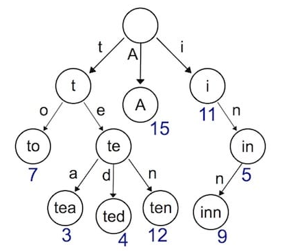
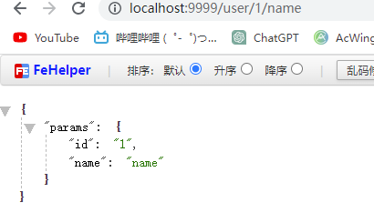
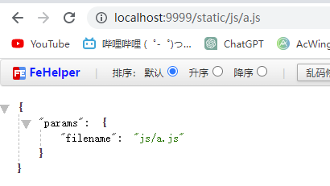

# web框架基本实现

## day1

想要实现web框架，我们得先利用net/http包帮助我们搭建服务器我们可以直接使用
```go
package main

import "net/http"

func main() {
	http.HandleFunc("/home", func(writer http.ResponseWriter, request *http.Request) {
		writer.Write([]byte("你好这是home"))
	})
	http.HandleFunc("/", func(writer http.ResponseWriter, request *http.Request) {
		writer.Write([]byte("你好这是root"))
	})
	http.ListenAndServe(":9999", nil)
}

```
以下代码可以实现简单服务器，通过HandleFunc给地址绑定handle然后通过ListenAndServe去开启服务

http.ListenAndServe中第二个参数可以传一个handle，接口规范如下
```go
type Handler interface {
	ServeHTTP(ResponseWriter, *Request)
}
```
因此实现 ServeHTTP方法就可以实现封装
```go
package main

import "net/http"

type Engine struct{}

func (engine *Engine) ServeHTTP(w http.ResponseWriter, r *http.Request) {
	switch r.URL.Path {
	case "/":
		w.Write([]byte("这是root"))
	case "/home":
		w.Write([]byte("这里是home"))
	default:
		w.Write([]byte("404 NOT FOUND"))
	}
}

func main() {
	engine := new(Engine)
	http.ListenAndServe(":9999", engine)
}
```

然后我们根据这个就可以构建出gin框架的雏形，我们要实现new一个engine然后通过get post等方法添加路由，我们把自己的框架叫做gee然后新建一个文件夹编写

```go
package gee

import "net/http"

type handleFunc func(w http.ResponseWriter, r *http.Request)

type Engine struct {
	router map[string]handleFunc
}

func New() *Engine {
	return &Engine{router: map[string]handleFunc{}}
}

func (e *Engine) addRouter(method string, pattern string, handle handleFunc) {
	key := method + "-" + pattern
	e.router[key] = handle
}
func (e *Engine) GET(pattern string, handle handleFunc) {
	e.addRouter("GET", pattern, handle)
}
func (e *Engine) POST(pattern string, handle handleFunc) {
	e.addRouter("POST", pattern, handle)
}
func (e *Engine) PUT(pattern string, handle handleFunc) {
	e.addRouter("PUT", pattern, handle)
}
func (e *Engine) DELETE(pattern string, handle handleFunc) {
	e.addRouter("DELETE", pattern, handle)
}

func (e *Engine) ServeHTTP(w http.ResponseWriter, r *http.Request) {
	key := r.Method + "-" + r.URL.Path
	if handle, ok := e.router[key]; ok {
		handle(w, r)
	} else {
		w.Write([]byte("404 not found"))
	}
}

func (e *Engine) Run(port string) error {
	return http.ListenAndServe(port, e)
}

```
main
```go
package main

import (
	"github.com/2281501756/7days-golang/web/gee"
	"net/http"
)

func main() {
	engin := gee.New()
	engin.GET("/", func(w http.ResponseWriter, r *http.Request) {
		w.Write([]byte("这里是root"))
	})
	engin.GET("/home", func(w http.ResponseWriter, r *http.Request) {
		w.Write([]byte("这里是home"))
	})
	engin.Run(":9999")
}

```
封装出gee框架的第一版，实现了框架的原型路由映射

## day2
昨天实现了http的基本服务今天需要拆分一下代码结构，使用context去封装，context封装之后便于我们使用

分成3个文件
```text
router  路由注册
context 上下文实现
gee     引擎基本操作
```
router中主要实现router的添加以及服务区运行之后router的匹配
context主要是封装上下文这样写代码的时候会方便很多


router代码如下
```go
package gee

type handleFunc func(c *Context)

type Router struct {
	handles map[string]handleFunc
}

func (r *Router) addRouter(method string, pattern string, handle handleFunc) {
	key := method + "-" + pattern
	r.handles[key] = handle
}

func (r *Router) handle(c *Context) {
	key := c.Method + "-" + c.Path
	if handle, ok := r.handles[key]; ok {
		handle(c)
	} else {
		c.Writer.Write([]byte("404 not found"))
	}
}

```

context代码如下
```go
package gee

import (
	"encoding/json"
	"net/http"
)

type H map[string]interface{}
type Context struct {
	Writer http.ResponseWriter
	Req    *http.Request

	// 路径
	Method string
	Path   string

	//
	StatusCode int
}

func newContext(w http.ResponseWriter, r *http.Request) *Context {
	return &Context{
		Writer: w,
		Req:    r,
		Method: r.Method,
		Path:   r.URL.Path,
	}
}

func (c *Context) PostForm(key string) string {
	return c.Req.FormValue(key)
}

func (c *Context) Query(key string) string {
	return c.Req.URL.Query().Get(key)
}

func (c *Context) SetHeader(key, value string) {
	c.Writer.Header().Set(key, value)
}

func (c *Context) Status(code int) {
	c.StatusCode = code
	c.Writer.WriteHeader(code)
}

func (c *Context) JSON(code int, obj interface{}) {
	c.Status(code)
	c.SetHeader("Content-Type", "application/json")

	encode := json.NewEncoder(c.Writer)
	if err := encode.Encode(&obj); err != nil {
		http.Error(c.Writer, err.Error(), http.StatusInternalServerError)
	}
}

func (c *Context) HTML(code int, html string) {
	c.Status(code)
	c.SetHeader("Content-Type", "text/html")

	c.Writer.Write([]byte(html))
}

func (c *Context) Data(code int, data []byte) {
	c.Status(code)
	c.Writer.Write(data)
}
```
gee代码如下
```go
package gee

import "net/http"

type Engine struct {
	router *Router
}

func New() *Engine {
	return &Engine{router: &Router{handles: map[string]handleFunc{}}}
}

func (e *Engine) addRouter(method string, pattern string, handle handleFunc) {
	e.router.addRouter(method, pattern, handle)
}
func (e *Engine) GET(pattern string, handle handleFunc) {
	e.addRouter("GET", pattern, handle)
}
func (e *Engine) POST(pattern string, handle handleFunc) {
	e.addRouter("POST", pattern, handle)
}
func (e *Engine) PUT(pattern string, handle handleFunc) {
	e.addRouter("PUT", pattern, handle)
}
func (e *Engine) DELETE(pattern string, handle handleFunc) {
	e.addRouter("DELETE", pattern, handle)
}

func (e *Engine) ServeHTTP(w http.ResponseWriter, r *http.Request) {
	c := newContext(w, r)
	e.router.handle(c)
}

func (e *Engine) Run(port string) error {
	return http.ListenAndServe(port, e)
}

```
这样代码结构就清晰很多了，代码之间使用context去传递值，在ServeHTTP的时候创建context，几乎实现了gin版本相同的api在使用的时候

**创建简单服务器**
```go
package main

import (
	"github.com/2281501756/7days-golang/web/gee"
)

func main() {
	engin := gee.New()
	engin.GET("/", func(c *gee.Context) {
		c.HTML(200, "<h1>你好这里是首页</h1>")
	})
	engin.GET("/home", func(c *gee.Context) {
		c.JSON(200, gee.H{
			"data": "这里是home",
			"code": 200,
		})
	})
	engin.Run(":9999")
}

```

## day3
实现一下前缀树路由，要支持在路由路径中使用 :name 和 *filepath这种格式的路由

这里就得使用树的数据结构来储存每一段path才能匹配



这里设计一下 trieNode的结构
```go
type node struct {
	pattern  string  // 匹配路径只有在匹配成功的叶子节点才值否则都为空字符串
	part     string  // 部分值代表这个节点值
	children []*node // 孩子
	isWild   bool    // 是否精准匹配 : 和 * 开头的一定匹配成功其他都是false
}
```
然后需要在router中新添加一个trieMap,用来存贮创建好的树，每一种请求方式都有一个树
```go
type Router struct {
	handleMap map[string]handleFunc // 路由与handle的map
	trieMap   map[string]*node      // 前缀树的map key是 GET POST这些value是路由的前缀树
}
```
然后编写router种的addRouter方法，这里需要看树根节点是否有值没有得先创建
```go
func (r *Router) addRouter(method string, pattern string, handle handleFunc) {
	key := method + "-" + pattern
	parseArray := parsePattern(pattern)
	if r.trieMap[method] == nil {
		r.trieMap[method] = &node{}
	}
	r.trieMap[method].insert(pattern, parseArray, 0)
	r.handleMap[key] = handle
}
```
这里又得编写node的insert方法和search方法
```go
func (n *node) insert(pattern string, parts []string, height int) {
	if len(parts) == height {
		n.pattern = pattern
		return
	}
	part := parts[height]
	child := n.matchChild(part)
	if child == nil {
		child = &node{part: part, isWild: part[0] == ':' || part[0] == '*'}
		n.children = append(n.children, child)
	}
	child.insert(pattern, parts, height+1)
}

func (n *node) search(pattern string, parts []string, height int) *node {
	if len(parts) == height || (len(n.part) > 0 && n.part[0] == '*') {
		if n.pattern == "" {
			return nil
		}
		return n
	}
	part := parts[height]
	children := n.matchChildren(part)
	for _, c := range children {
		res := c.search(pattern, parts, height+1)
		if res != nil {
			return res
		}
	}
	return nil
}
```
插入方法就是看子节点是否有匹配的有匹配的就在子节点种插入，没有就创建子节点然后递归记录层数

查找方法与插入方法类似都是记录层数然后递归这里查找的时候如果层数相等的时候还需要看看n.pattern
是否为空字符串，如果是空字符串则代表不是叶子节点不能匹配上

最后再修改router种的handle方法，正确匹配到handle
```go
func (r *Router) getRouter(method, path string) (*node, map[string]string) {
	parseArray := parsePattern(path)
	if r.trieMap[method] == nil {
		return nil, nil
	}
	n := r.trieMap[method].search(path, parseArray, 0)
	if n == nil {
		return nil, nil
	}
	params := map[string]string{}
	parts := parsePattern(n.pattern)

	for i, item := range parts {
		if item[0] == ':' {
			params[item[1:]] = parseArray[i]
		}
		if item[0] == '*' && len(parts) > 1 {
			params[item[1:]] = strings.Join(parseArray[i:], "/")
			break
		}
	}
	return n, params

}

func (r *Router) handle(c *Context) {
	n, params := r.getRouter(c.Method, c.Path)
	if n != nil {
		key := c.Method + "-" + n.pattern
		c.Params = params
		r.handleMap[key](c)
	} else {
		_, err := c.Writer.Write([]byte("404 not found"))
		if err != nil {
			panic("404 not found")
		}
	}
}
```
这里写了一个getRouter方法返回匹配到的node节点以及paramsMap如果节点为空则代表没有匹配的路由返回404
如果有则key变为 Method + '-' + n.pattern

这里不能继续使用c.path,要使用我们根据c.path匹配到的注册路径

这样就基本实现了前缀树路由的功能

主函数编写测试
```go
	engin.GET("/user/:id/:name", func(c *gee.Context) {
		c.JSON(200, gee.H{
			"params": c.Params,
		})
	})
	engin.GET("/static/*filename", func(c *gee.Context) {
		c.JSON(200, gee.H{
			"params": c.Params,
		})
	})
```




